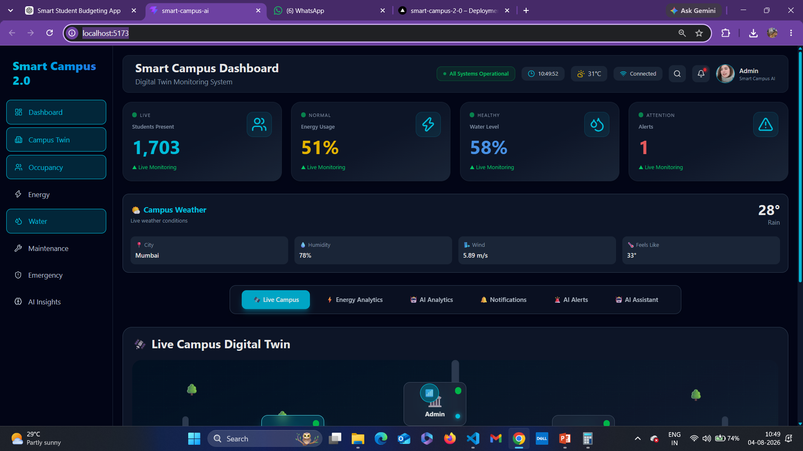
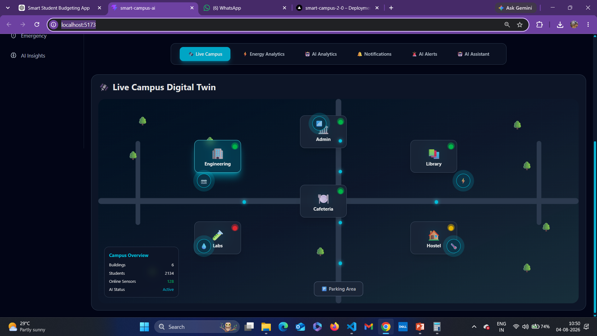
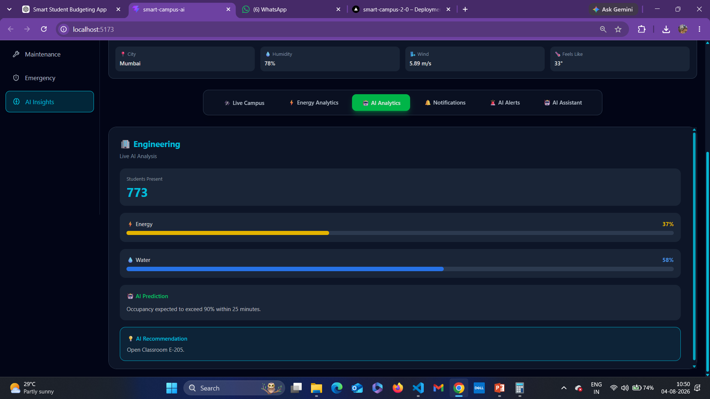
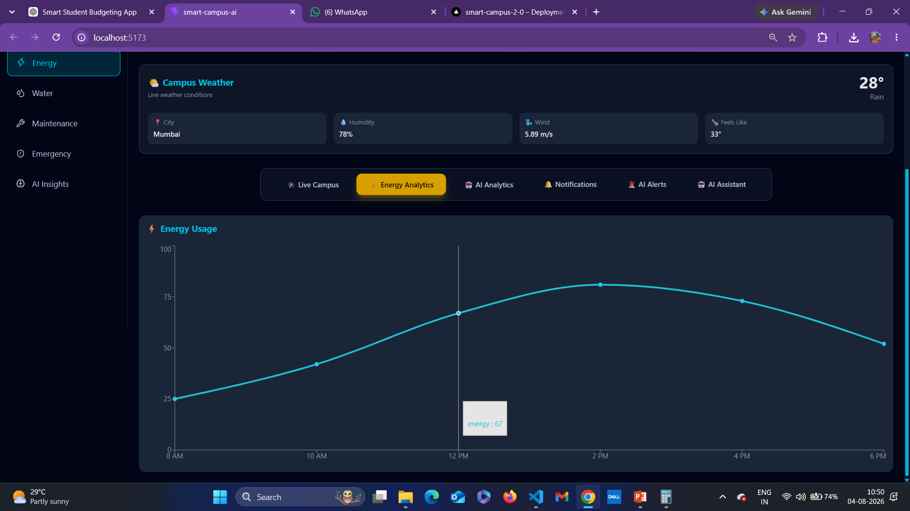
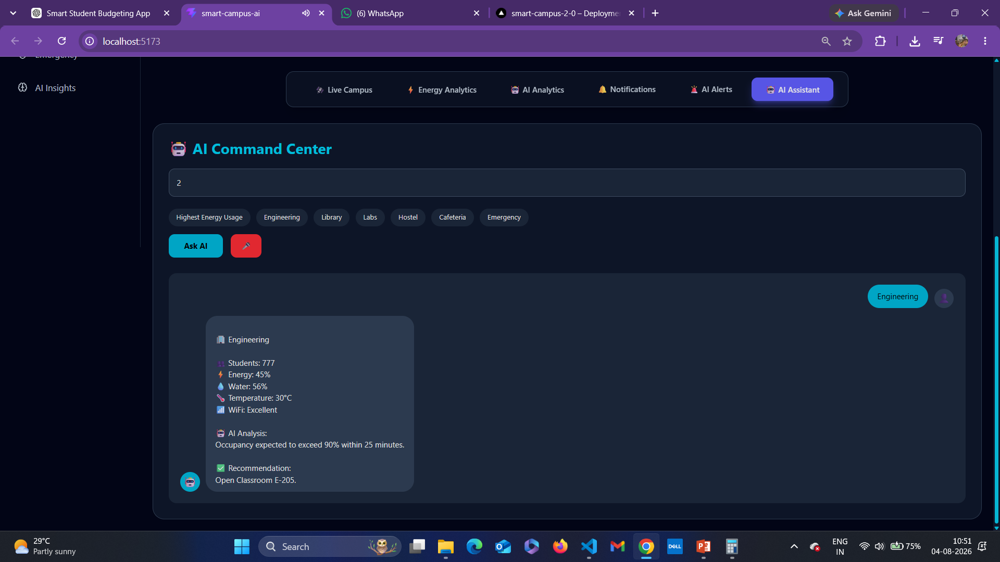
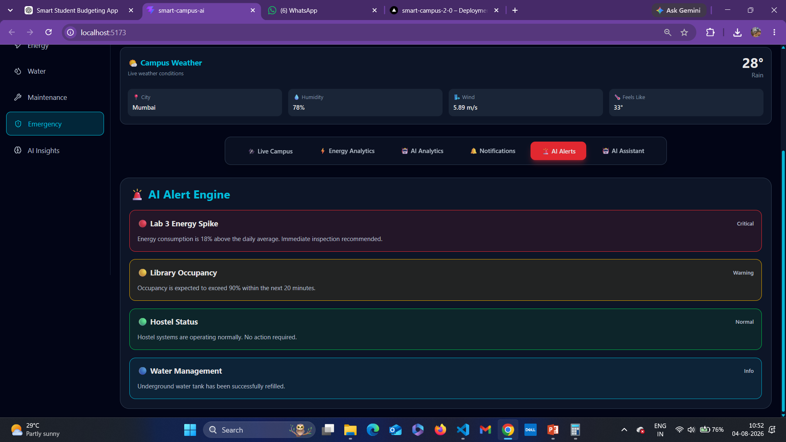
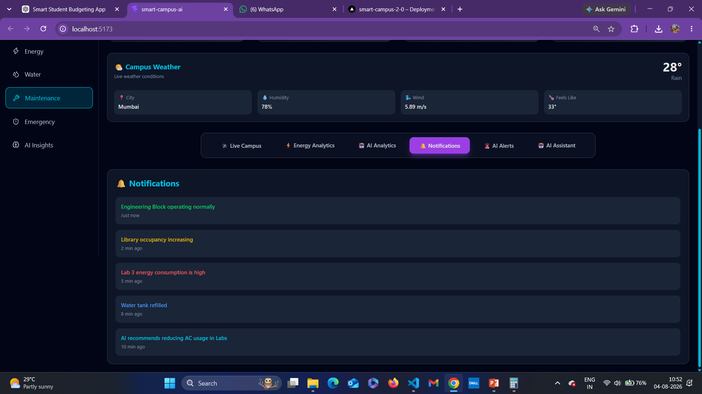

# 🛰 Smart Campus 2.0

> An AI-Powered Digital Twin Platform for Intelligent Campus Management

Smart Campus 2.0 is a modern web application that simulates a smart college campus using Digital Twin technology, AI-powered analytics, IoT sensor simulation, live weather integration, and an intelligent voice assistant.

---

## 🚀 Live Demo

🌐 **Vercel:**  
https://smart-campus-2-0.vercel.app/

📂 **GitHub Repository:**  
https://github.com/paragkharad2007-star/Smart-Campus-2.0

---

# 📖 Overview

Smart Campus 2.0 is an AI-powered Digital Twin platform that enables administrators to monitor campus operations through an interactive dashboard.

The project visualizes buildings, occupancy, energy consumption, water usage, weather, AI insights, notifications, emergency alerts, and voice interaction within a single interface.

---

# ✨ Features

## 🛰 Digital Twin Campus

- Interactive campus map
- Smart buildings
- Animated student movement
- Sensor visualization
- Parking area
- Green campus visualization

---

## 🤖 AI Analytics

- Building-wise AI analysis
- AI recommendations
- Occupancy monitoring
- Infrastructure insights

---

## ⚡ Energy Analytics

- Live energy dashboard
- Interactive charts
- Resource monitoring
- Consumption visualization

---

## 🌦 Live Weather

- Real-time weather
- Temperature
- Humidity
- Wind Speed
- Feels Like Temperature

Powered by OpenWeather API.

---

## 🎤 AI Voice Assistant

- Voice interaction
- Speech recognition
- Natural language queries
- Building information
- Emergency status
- Energy queries

---

## 🚨 AI Alert Engine

- Emergency alerts
- Building monitoring
- Resource anomalies
- AI generated alerts

---

## 🔔 Notification Center

- Campus notifications
- AI updates
- System alerts

---

# 🛠 Tech Stack

### Frontend

- React
- Vite
- Tailwind CSS

### Libraries

- Recharts
- Lucide React
- React Icons

### APIs

- OpenWeather API
- Web Speech API

### Deployment

- GitHub
- Vercel

---

# 📂 Project Structure

```
Smart-Campus-2.0
│
├── screenshots
├── src
│   ├── components
│   ├── data
│   ├── pages
│   ├── utils
│   └── assets
│
├── public
├── README.md
└── package.json
```

---

# 📸 Project Screenshots

## 🏠 Dashboard



---

## 🛰 Live Campus Digital Twin



---

## 🤖 AI Analytics



---

## ⚡ Energy Analytics



---

## 🎤 AI Voice Assistant



---

## 🚨 AI Alert Engine



---

## 🔔 Notification Center



---

# 🎯 Future Scope

- Real IoT Sensor Integration
- AI CCTV Monitoring
- Face Recognition Attendance
- Smart Parking System
- Drone Surveillance
- Renewable Energy Optimization
- Predictive Maintenance
- Mobile Application
- Multi-Campus Dashboard
- Cloud Database Integration

---

# 💡 Key Highlights

- ✅ AI-Powered Digital Twin
- ✅ Responsive Design
- ✅ Live Weather Integration
- ✅ Interactive Energy Analytics
- ✅ Voice Assistant
- ✅ AI Insights
- ✅ Emergency Monitoring
- ✅ Modern UI/UX


---

# 👨‍💻 Author

## Parag Kharad
Second Year Engineering Student

GitHub:  
https://github.com/paragkharad2007-star

---

# ⭐ Support

If you found this project useful, consider giving it a ⭐ on GitHub.

It motivates me to build more innovative projects.

---

## 📜 License

This project is developed for educational, research, and hackathon purposes.